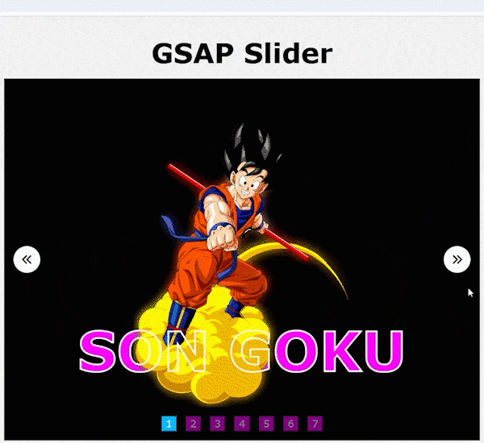

# GSAP Slider

A simple and visually appealing image slider using GSAP (GreenSock Animation Platform). The slider allows users to navigate through various anime character images with smooth animations and transitions.

## Features
- Smooth slide transitions using GSAP animations
- Navigation buttons (Previous & Next)
- Dots indicator for quick navigation
- Randomized neon color effects for text
- Responsive and mobile-friendly design

## Demo


## Technologies Used
- HTML
- CSS
- JavaScript
- GSAP (GreenSock Animation Platform)
- FontAwesome (for navigation icons)

## Installation
1. Clone the repository:
   ```bash
   git clone https://github.com/your-username/gsap-slider.git
   ```
2. Navigate to the project folder:
   ```bash
   cd gsap-slider
   ```
3. Open `index.html` in your browser.

## Usage
- Click the **Next** and **Previous** buttons to navigate through slides.
- Click on the dots below to jump to a specific slide.

## Folder Structure
```
/gsap-slider
│── images/        # Image assets
│── index.html     # Main HTML file
```

## Dependencies
- [GSAP](https://cdnjs.cloudflare.com/ajax/libs/gsap/3.12.5/gsap.min.js)
- [FontAwesome](https://cdnjs.cloudflare.com/ajax/libs/font-awesome/6.7.2/css/all.min.css)

## Contributing
Feel free to fork this repository and submit pull requests with improvements.
## 🎥 Video Tutorial
Watch the tutorial video: [Learn By Video](https://youtu.be/VMu0ktdnyrk?si=2jVw_Q00HyPzwqHc)
## Blog Post Tutorial
🐦 blog post: [Read Blog Post](https://docode.co.in/post/gsap-slider-tutorial-animated-image-carousel) 
## 📩 Connect With Me
🌐 Website: [DoCode](https://docode.co.in/)
📧 Email: docode537@gmail.com 

